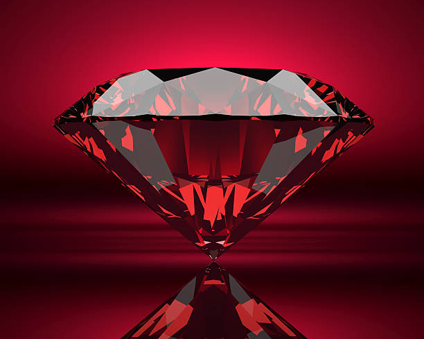
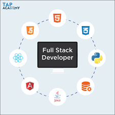
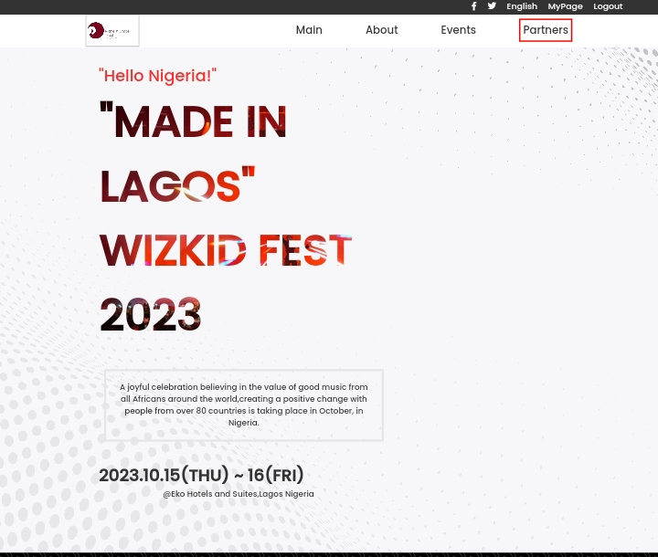
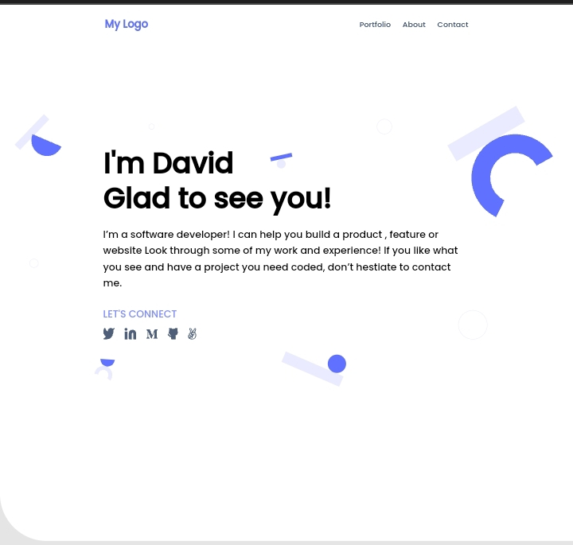
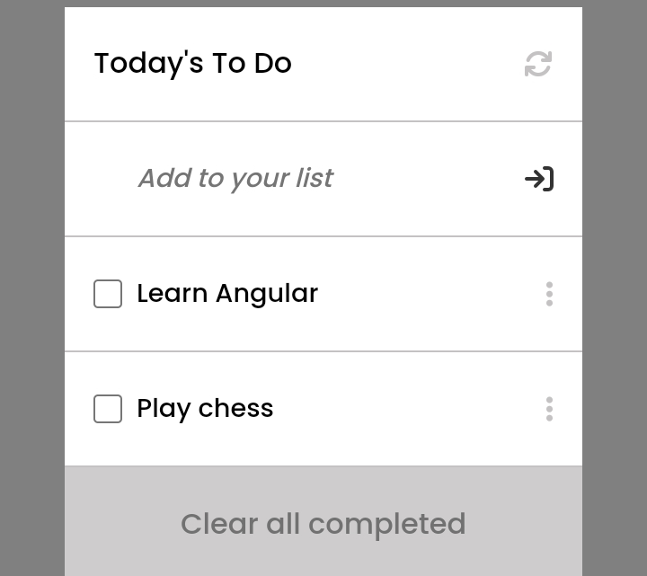
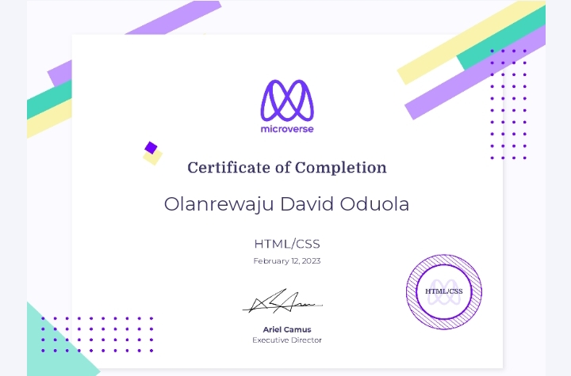

# Hello, I'm David 👋

I am a Full-Stack Developer with over a year of experience in Software Engineering.
I am passionate about politics and teaching and I enjoy playing chess in my free time.

## Skills

- HTML  

- CSS  

- JavaScript 

- React 

- Ruby  

- Ruby on Rails 

- Full Stack Dev 

## Experience
### Microverse (United States of America)

- Remote Student
- Student Mentor
- Full Stack Developer

## Education

- National Diploma in Mechanical Engineering, The Polytechnic of Ibadan, Nigeria
- Pending Degree in Industrial and Production Engineering, The Federal University of Technology, Akure Nigeria

## Projects
> Below are some of the projects i have worked on...(please click on images and navigate to the live demo link to get a detailed view of projects)

- 

> This capstone project is about a music festival in my country. I created it in honor of my favorite artiste, Wizkid. Stack: HTML, CSS, JavaScript.

- 

> This is a project I used in the practice of my html and css skills. It is a portfolio project. Stack: HTML and CSS

- 

> This project is containing a ToDo list which I used to sharpen my skills in JavaScript and also to learn how to use web packs efficiently. Stack: HTML, CSS, JavaScript, Webpack.

## Stats

&nbsp;

## Certifications

- Programming in HTML5 with CSS3 - 
## Contact Me

-  
-  

### Feel free to reach out to me If you have any questions or If you'd like to collaborate on a project.
